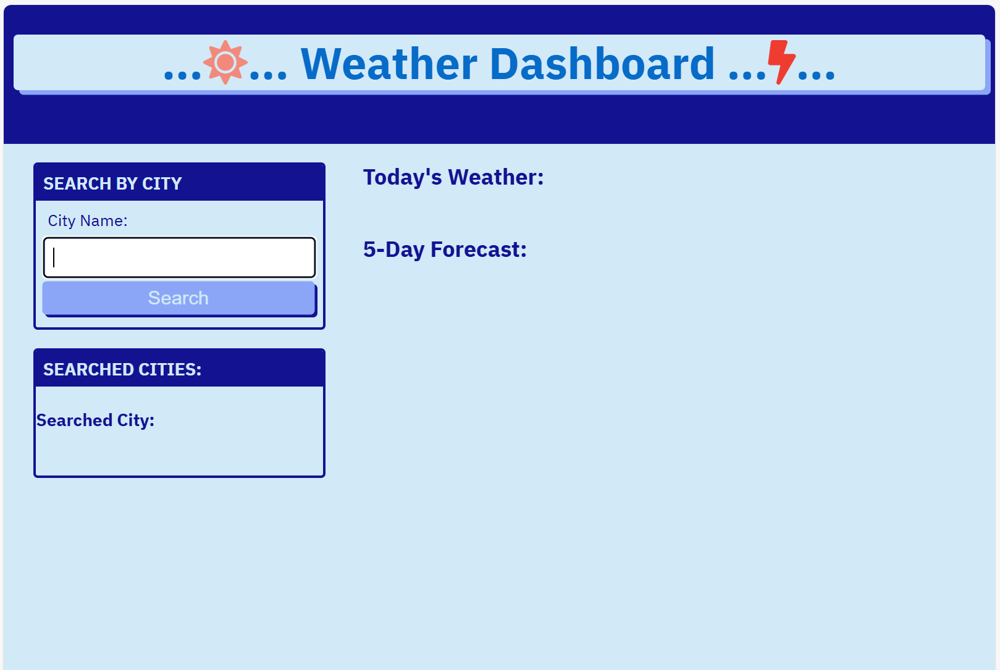
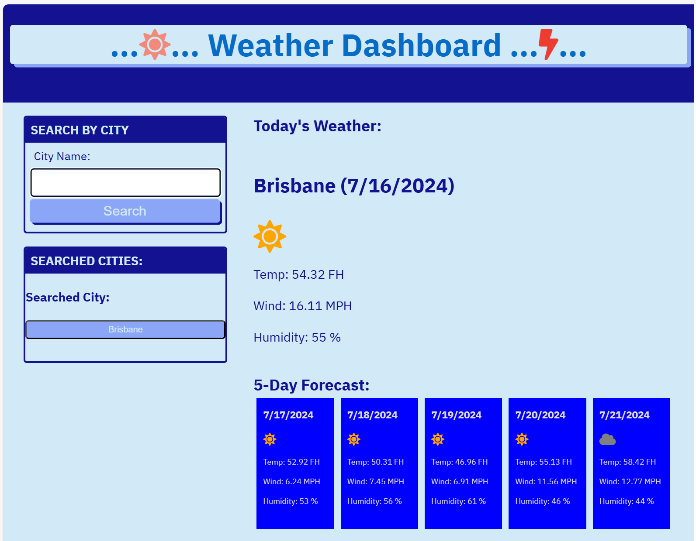
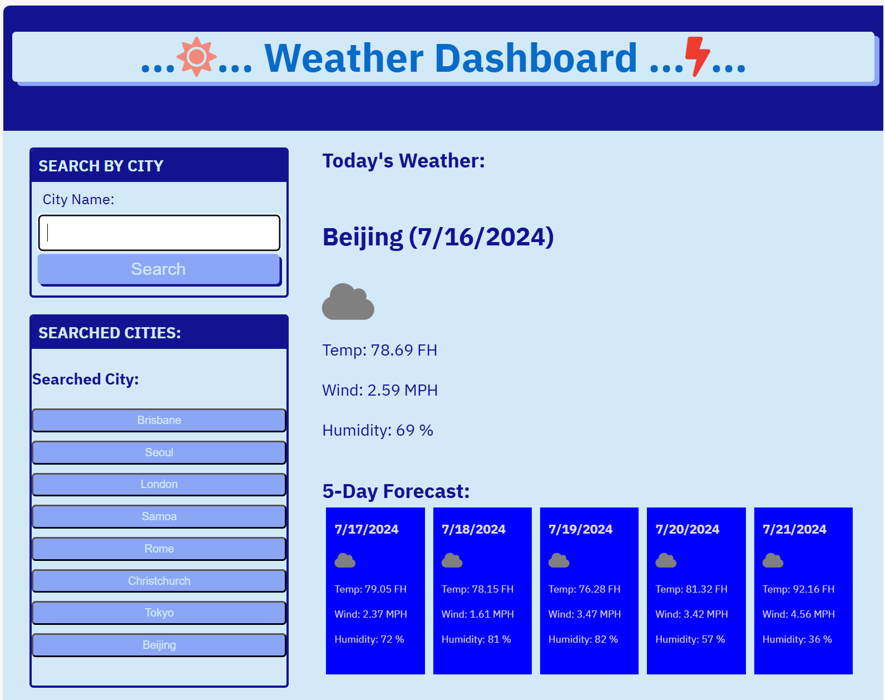
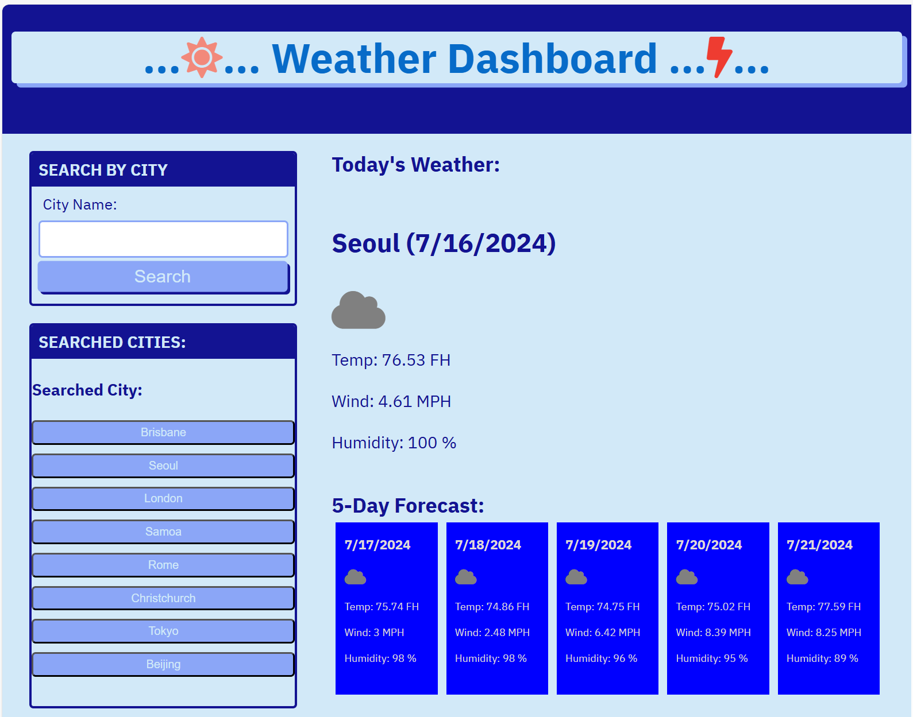

README.md

** Title: Weather Dashboard (Challeng-6).
** Author: Taewoo Kim (TK).
** Submitted: 16 Jul 2024.

** Working procedures: 
 * Basically, I have reused the codes from '23-Ins_Review-Part-Two' in '06-SERVER-SIDE-APIS' module,
   and made needed adjustments to make it work and meet the Acceptance Criteria. 
 * Structure of the main screen: quickly draw a wireframe and updated the index.html file, accordingly.
   - <header> : implemented some 'Awsome Font', Sun and Bolt. It was AWESOME...^^. 
   - <main>
   -   
 : Section for accepting 'City Name' from user.
   -   
 : Section for listing city names user entered, so far.
   -   
 : Section for displaying one day(today)'s weather information.
   -   
 : Section for displaying 5 day (starting the day after today) weather information.
 * Style: I just reused the style.css file, and added a few things, as needed. 
 * Javascript: Implemented functions in 'weather.js' file.
   - formSubmitHandler() : Accept User Input.
   - displayCities() : Display the cities, user has entered, so far.
   - displayOneDayWeather() : Display 1 Day Weather Data for the entered city.
                              City Name, Date, Weather Icon, Temp, Wind and Humidity.
   - displayFiveDayWeathers() : Display 5 Day Forecast for the entered city after today
                                Date, Weather Icon, Temp, Wind and Humidity.

** Comments:
 * Due to my travel to Korea and China, I just finished Challenge-6.
 * I believe the purpose of this challenge is to familiarize oneself with the APIs available out there.
   How to fetch the needed data, display it on the screen, and interact with a user in front-end. 
 * I had to go through all the recorded lectures to understand the concepts, and heavily relied on 
   the 'Exper Learning Assistant' everytime I got stuck.
 * Now, I'm little bit more comfortable working on APIs and would like to work on it a little more. 
   Learned a lot and expect more exciting challenges in the future...^^. 

** Results: AC(Acceptance Criteria)
 * Initial Screen: 
   AC-1: WHEN I search for a city
         THEN I am presented with current and future conditions for that city 
              and that city is added to the search history

 * After a City Name is entered.
   AC-2: WHEN I view current weather conditions for that city, 
         THEN I am presented with the city name, the date, an icon representation of 
              weather conditions, the temperature, the humidity, and the wind speed

 * After a few more City Names been entered.
   AC-3: WHEN I view future weather conditions for that city
         THEN I am presented with a 5-day forecast that displays the date, 
         an icon representation of weather conditions, the temperature, the wind speed, and the humidity.

 * When one of the City Name (Seoul) is clicked from the City Name list on the left.
   AC-4: WHEN I click on a city in the search history
         THEN I am again presented with current and future conditions for that city.

